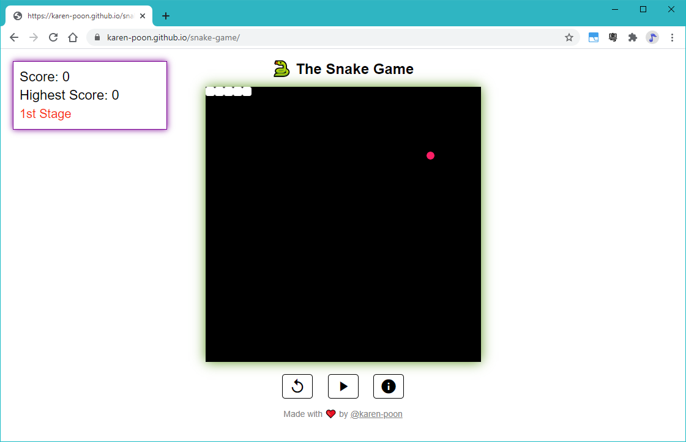
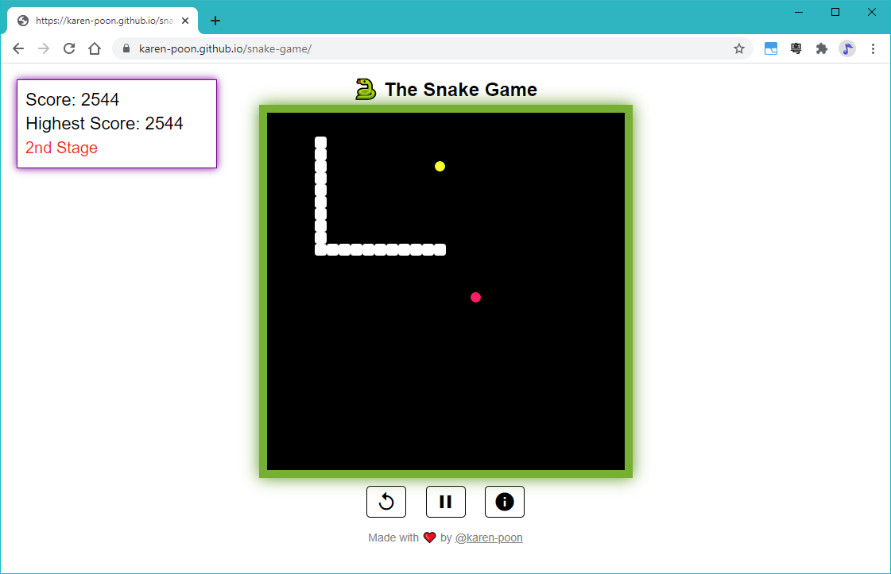
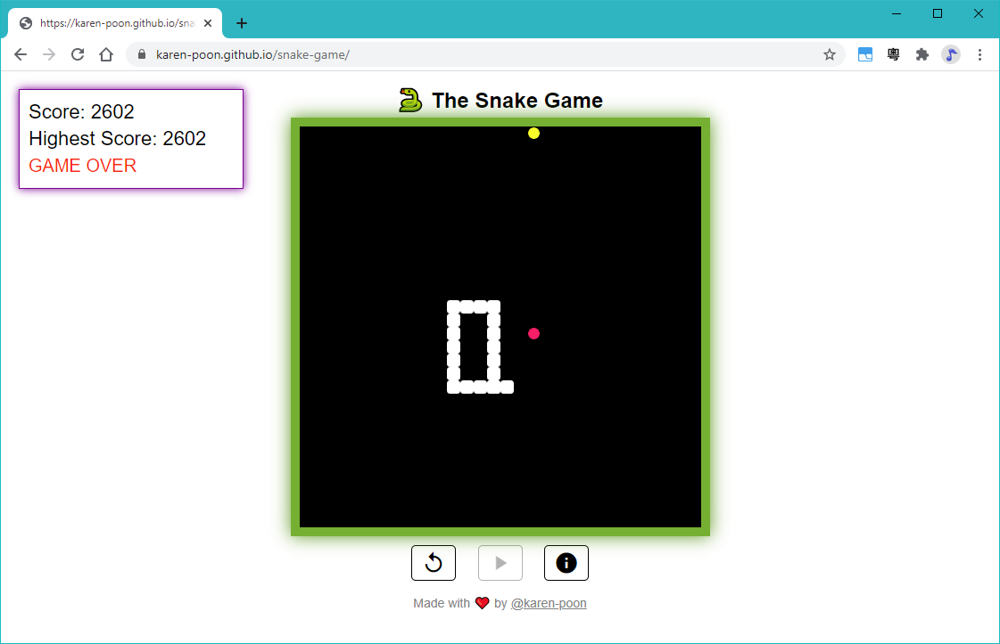
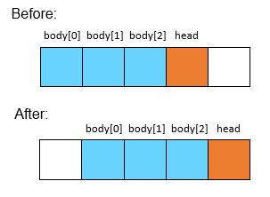
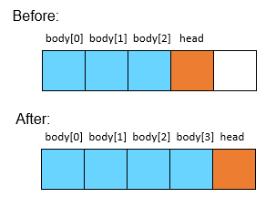

# 🐍 The Snake Game

Check the game here: https://karen-poon.github.io/snake-game/
(use Chrome!)

This is the traditional snake game that I made using the p5.js library.

<p align="center"></p>

## How to play
The goal is to let the snake eat as many food as possible. The snake can loop through the canvas, meaning if it goes out of border, it will reappear at the opposite side.
Each step the snake takes counts for <b>1 point</b>. Each food the snake eats counts for <b>100 points</b>.

Once you have reached <b>2000 points</b>, you will enter the 2nd stage.
Special food will start to appear and change its position <i>every 5 seconds</i>. Each special food counts for <b>300</b> points instead!
<p align="center"></p>

The game will end if the snake eats itself. Highest score will be lost after you refresh or close the browser.
<p align="center">

## Concepts
### The Snake 🐍
The snake is an object that contains the following <b>attributes</b>:
- `head`: Head of the snake. It is used to check when it eats the food, whether it is out of the canvas bounds, and whether it ate itself.
- `body[]`: An array of the snake's body NOT including the head. It actually stores its body starting from its tail to (before) head. Will tell you why I did that later.
- `xSpeed`: The x-direction that the snake is travelling. 1 = travelling to the right, -1 = travelling to the left.
- `ySpeed`: The y-direction that the snake is travelling. 1 = travelling downwards, -1 = travelling upwards. 
            (p5.js is the opposite of the traditional math coordinates for the y-axis).
- `len`: Length of the body NOT including the head. Just using it for my for loops.

It also contains the following <b>methods</b>:
- `travel()`: Instructs the snake to move the head and body by 1 step.
- `grow()`: Increases the snake's body `len` by 1 after eating food. Do NOT need to call `travel()` after `grow()`.
- `changeDir(xdir, ydir)`: Changes the snake's travelling direction to `xdir` and `ydir`. Basically changing `xSpeed` and `ySpeed`.
- `isEat(food_pos)`: Returns true if the snake ate the food. `food_pos` tells the snake where the current food position is.
- `changeIfOutOfBounds()`: When the snake's head or body goes out of canvas bounds, it changes its position to the opposite side. 
    This function is used when it's travelling.
- `print()`: Draws the snake onto the canvas.
- `reset()`: Resets the snake's position when user restarts the game.

#### More on `travel()`
This image demonstrates how the snake moves:



From that I wrote the following pseudo code:
```
body[0] = body[1]
body[1] = body[2]
body[2] = head
head = head + 1 step
```
So why did I make an array of body starting from its tail? It's because, for assigning a new body position, I can start looping from index `0`! 
(All software engineers love counting from `0`). If it's the other way, we would have to start looping from index `1` instead.

There is another method of travelling, which is to pop `body[0]`, push it to the end of `body[]`, and assign its position at the original `head`'s position. 
Yes, this sounds quicker than the method above. However, in JavaScript, we have to use `shift()` to pop the first element of the array. 
`shift()` actually takes O(n) time to move the array, which is the same as the method above. Making the snake's body start from after head will be the same too.
I decided to stick with the method above because it looks more legible than this method, and it's helpful for the following `grow()` method.
(I know I could have used a linked list, but I think it would make more sense if js has pointers like in C)

#### More on `grow()`

This image demonstrates how the snake grows:



From that I wrote the following pseudo code:
```
body[3] = head
head = head + 1 step
```
Since I'm new to JavaScript, I find that being able to call `body[3]` is weird. There wasn't `body[3]` in the original array.
But I can call it to kind of instruct it to expand the array. This is also why I find making the body start from tail a better method. 
I can just assign `body[3]` to `head` instead of looping through the whole array and assign each with a new value.

### Food 🔴🟡
There are 2 types of food, the normal one 🔴 and a special one 🟡. I made the following helper functions for food:
- `generateFood()`: Generates food at a random position.
- `makeValidFood(food, otherFood)`: Checks if the current food position is valid. If not, it returns a valid position. 
  A valid position means that it does NOT appear at the other food's position, or at the snake's head or body. It will regenerate a new position until it is valid.
- `printFood(food)`: Draws the normal food onto the canvas.
- `printSpecialFood(food)`: Draws the speical food onto the canvas.

For special food 🟡, it needs to generate at a new position for every 5 seconds. I made a timer (a counter) that countdowns from 5. 
I have set the `frameRate()` for this game as `10` (it draws 10 frames in each second). Whenever the timer reaches a number divisible by 10,
it means that 1 second has passed.
So when the timer reaches 0, it regenerates special food's position and resets the timer.

### The Game 🕹️
Player can control when to start, pause, or restart the game. They can control the snake using arrow keys on the keyboard too.
- `startGame()`: When the player clicks ▶️, the snake can start `travel()`ing. If the player clicks it after they paused the game, the game resumes.
- `pauseGame()`: When the player clicks ⏸️, the snake stops `travel()`ing.
- `newGame()`: When the player clicks 🔄, it resets the snake's position, food's position, score, and timer. 
- `keyPressed()`: This function is recoginzed by p5.js. Whenever the user hits a key, it calls this function. For my implementation, it will call `changeDir()` when the user
  attempts to change the snake's travelling direction by pressing the arrow keys. I made it to ignore the opposite direction keys. For example, 
  if the snake is moving to the right, and the player pressed the left key, it will be ignored. This is to avoid being mistaken as eating itself.
- `isGameOver()`: Returns true if the snake eats itself. This is also the only way that the game is over.

### Scoreboard 💯
Player can move the scoreboard around. At first I wanted to make the cursor as `drag`, and change it to `dragging` when the player clicks or moves it.
However, I found that browsers do not allow changing cursors while moving. At last, I choose to use `all-scroll` instead.

##
Had a lot of fun making this game! Enjoy :)
  
